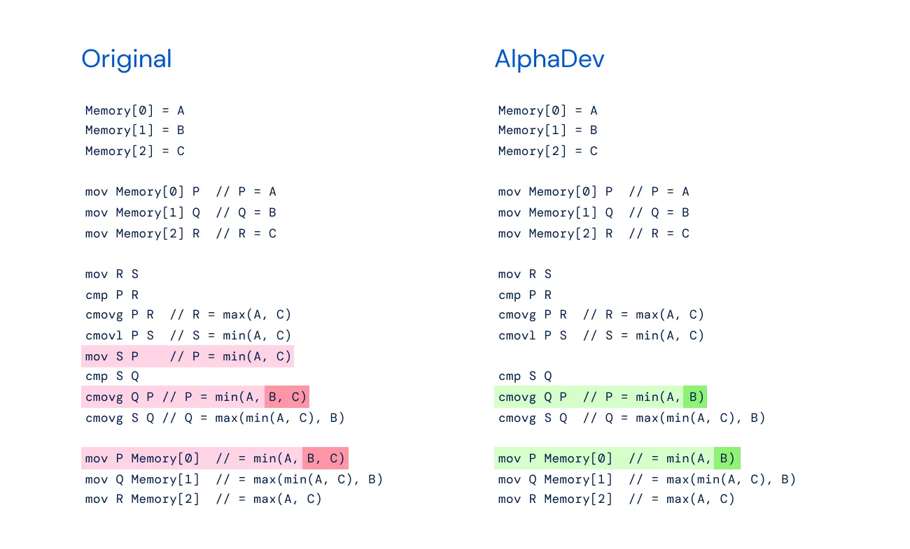
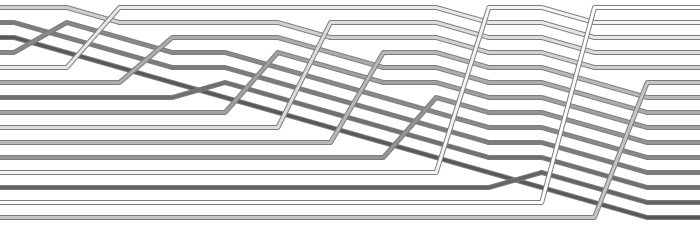
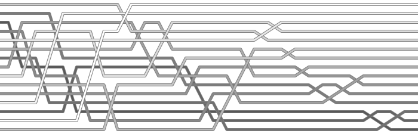
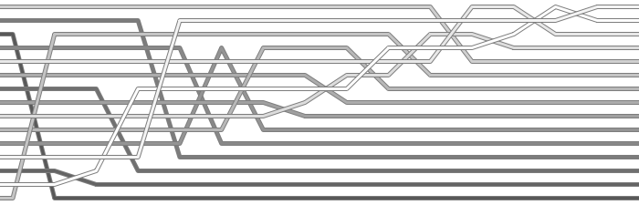
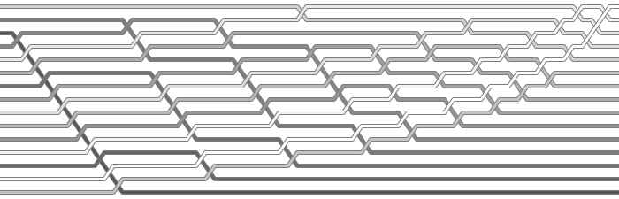
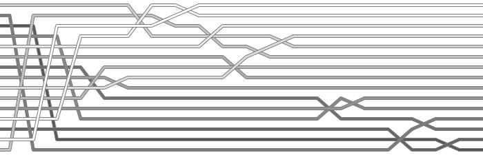
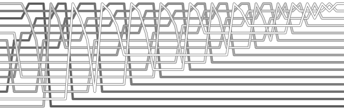

排序算法作为最基本的算法之一，其重要性不言而喻，时至今日仍在被优化改进。

2023 年 6 月 8 日，Google DeepMind 新作 AlphaDev 发现了更快的排序算法，同时相关文章 [Faster sorting algorithms discovered using deep reinforcement learning](https://www.nature.com/articles/s41586-023-06004-9) 在 Nature 发表。

有趣的是不久后 Dimitris Papailiopoulos 发推 [GPT-4 "discovered" the same sorting algorithm as AlphaDev by removing "mov S P"](https://twitter.com/DimitrisPapail/status/1666843952824168465) 表示通过合适的提示词，GPT-4 也能得到同样结果，还引得马斯克围观。

C++ STL 中 std::sort 采用的是 David Musser 提出的混合排序算法，主要使用快速排序，同时记录递归深度，看情况转为堆排序，此外对短数据采用其他排序算法。具体实现可参考 Go 1.18 的 [sort](https://github.com/golang/go/blob/release-branch.go1.18/src/sort/sort.go) 包，相较 C++ 可读性更强。

LLVM 作为被广泛使用的 C++ 编译后端，其 libc++ 对于短数据采用手写 sort3 sort4 sort5 的形式，AlphaDev 对此进行了优化，相关 [Commit](https://github.com/llvm/llvm-project/commit/194d1965d2c841fa81e107d19e27fae1467e7f11) 已被合并，这也是排序算法库十多年来第一次更新。

AlphaDev 从汇编出发，以发现更快的排序和散列算法为目标，通过强化学习解组合优化问题，根据计算耗时和结果来评估奖励，不断迭代，最后在底层发现了可优化的部分。

图为 sort3 汇编代码的前后对比，难以相信被优化了几十年，每天被调用数万亿次的排序算法，还存在着如此简单的优化方法。



- mov: move
- cmp: compare
- cmovg: conditional move if greater
- cmovl: conditional move if less

大模型的推理主要是模式识别，知识整合等，而非真正的逻辑推理。但我经过验证，在指定范围的情况下，最新的 GPT-4 的确可以对上述代码进行优化，得到与论文相同的结果。此外，大模型能否作为通解代替特定程序，去优化更多微小细节，还有待研究。

---

十大排序算法：插入排序、希尔排序、选择排序、冒泡排序、快速排序、堆排序、归并排序、计数排序、桶排序、基数排序。

|   name    |    time    |  space   | stable |
| :-------: | :--------: | :------: | :----: |
| insertion |   $n^2$    |   $1$    |  yes   |
|   shell   |   $n^2$    |   $1$    |   no   |
| selection |   $n^2$    |   $1$    |   no   |
|  bubble   |   $n^2$    |   $1$    |  yes   |
|   quick   | $n \log n$ | $\log n$ |   no   |
|   heap    | $n \log n$ | $\log n$ |   no   |
|   merge   | $n \log n$ |   $n$    |  yes   |
| counting  |  $n + k$   | $n + k$  |  yes   |
|  bucket   |  $n + k$   |   $nk$   |  yes   |
|   radix   | $d(n + k)$ | $n + k$  |  yes   |

相同的算法也有不同的实现，此处算法的处理对象为数组，其中希尔排序的平均时间复杂度取决于所选序列，快速排序和堆排序的空间复杂度取决于重复方式，$k$ 分别为计数范围、桶数、基数，$d$ 为阶数。

插入排序：
```c
void insertion_sort(int arr[], int len) {
    for (int i = 1; i < len; i++) {
        int j, key = arr[i];
        for (j = i; j > 0; j--)
            if (arr[j - 1] > key)
                arr[j] = arr[j - 1];
            else
                break;
        arr[j] = key;
    }
}
```


希尔排序：
```c
void shell_sort(int arr[], int len) {
    int n = 3, gap[] = {1, 3, 5};
    while (n--)
        for (int h = gap[n], i = h; i < len; i++)
            for (int j = i; j >= h; j -= h)
                if (arr[j - h] > arr[j])
                    swap(arr, j - h, j);
                else
                    break;
}
```


选择排序：
```c
void selection_sort(int arr[], int len) {
    for (int i = len - 1; i > 0; i--) {
        int max = i;
        for (int j = 0; j < i; j++)
            if (arr[j] > arr[max])
                max = j;
        swap(arr, max, i);
    }
}
```


冒泡排序：
```c
void bubble_sort(int arr[], int len) {
    for (int i = 0; i < len - 1; i++)
        for (int j = 0; j < len - 1 - i; j++)
            if (arr[j] > arr[j + 1])
                swap(arr, j, j + 1);
}
```


快速排序：
```c
void quick(int arr[], int l, int r) {
    if (l >= r)
        return;
    int mid = arr[(l + r) / 2], i = l, j = r;
    while (i <= j) {
        while (arr[i] < mid)
            i++;
        while (arr[j] > mid)
            j--;
        if (i <= j)
            swap(arr, i, j), i++, j--;
    }
    quick(arr, l, j);
    quick(arr, i, r);
}
void quick_sort(int arr[], int len) {
    quick(arr, 0, len - 1);
}
```


堆排序：
```c
void heap(int arr[], int len, int i) {
    int max = i, l = 2 * i + 1, r = 2 * i + 2;
    if (l < len && arr[max] < arr[l])
        max = l;
    if (r < len && arr[max] < arr[r])
        max = r;
    if (max != i)
        swap(arr, i, max), heap(arr, len, max);
}
void heap_sort(int arr[], int len) {
    for (int i = len / 2 - 1; i >= 0; i--)
        heap(arr, len, i);
    for (int i = len - 1; i > 0; i--)
        swap(arr, 0, i), heap(arr, i, 0);
}
```


归并排序：
```c
void merge(int arr[], int tmp[], int l, int r) {
    if (l >= r)
        return;
    int m = (l + r) / 2;
    merge(arr, tmp, l, m);
    merge(arr, tmp, m + 1, r);
    int i = l, j = m + 1, k = l;
    while (i <= m && j <= r)
        tmp[k++] = arr[i] <= arr[j] ? arr[i++] : arr[j++];
    while (i <= m)
        tmp[k++] = arr[i++];
    while (j <= r)
        tmp[k++] = arr[j++];
    for (i = l; i <= r; i++)
        arr[i] = tmp[i];
}
void merge_sort(int arr[], int len) {
    int tmp[len];
    merge(arr, tmp, 0, len - 1);
}
```

计数排序：
```c
void counting_sort(int arr[], int len) {
    int MIN = 0, MAX = 99;
    int num = 100;
    int cnt[num], tmp[len];
    for (int i = 0; i < num; i++)
        cnt[i] = 0;
    for (int i = 0; i < len; i++)
        cnt[arr[i]]++;
    for (int i = 1; i < num; i++)
        cnt[i] += cnt[i - 1];
    for (int i = len - 1; i >= 0; i--)
        tmp[--cnt[arr[i]]] = arr[i];
    for (int i = 0; i < len; i++)
        arr[i] = tmp[i];
}
```

桶排序：
```c
void bucket_sort(int arr[], int len) {
    int MIN = 0, MAX = 99;
    int num = 10, gap = 10;
    int cnt[num], tmp[num][len];
    for (int i = 0; i < num; i++)
        cnt[i] = 0;
    for (int i = 0; i < len; i++)
        tmp[arr[i] / gap][cnt[arr[i] / gap]++] = arr[i];
    for (int i = 0; i < num; i++)
        insertion_sort(tmp[i], cnt[i]);
    for (int n = 0, i = 0; i < num; i++)
        for (int j = 0; j < cnt[i]; j++)
            arr[n++] = tmp[i][j];
}
```

基数排序：
```c
void radix_sort(int arr[], int len) {
    int MIN = 0, MAX = 99;
    int num = 10;
    int cnt[num], tmp[len];
    for (int exp = 1; exp <= MAX; exp *= num) {
        for (int i = 0; i < num; i++)
            cnt[i] = 0;
        for (int i = 0; i < len; i++)
            cnt[(arr[i] / exp) % num]++;
        for (int i = 1; i < num; i++)
            cnt[i] += cnt[i - 1];
        for (int i = len - 1; i >= 0; i--)
            tmp[--cnt[(arr[i] / exp) % num]] = arr[i];
        for (int i = 0; i < len; i++)
            arr[i] = tmp[i];
    }
}
```
