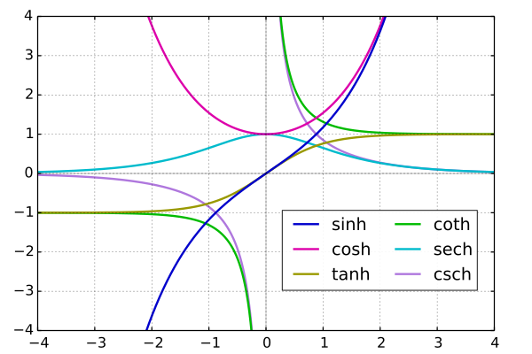
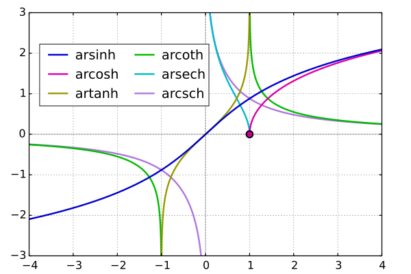

**Hyperbolic Function**

$\sinh z = \frac{e^z - e^{-z}}{2} = -i \sin iz$

$\cosh z = \frac{e^z + e^{-z}}{2} = \cos iz$

$\tanh z = \frac{e^z - e^{-z}}{e^z + e^{-z}} = -i \tan iz$

$\coth z = \frac{e^z + e^{-z}}{e^z - e^{-z}} = i \cot iz$

$\operatorname{sech} z = \frac{2}{e^z + e^{-z}} = \sec iz$

$\operatorname{csch} z = \frac{2}{e^z - e^{-z}} = i \csc iz$

**Inverse Hyperbolic Function**

$\operatorname{arsinh} z = \operatorname{Ln}(z + \sqrt{z^2 + 1})$

$\operatorname{arcosh} z = \operatorname{Ln}(z + \sqrt{z + 1} \sqrt{z - 1})$

$\operatorname{artanh} z = \frac{1}{2} \operatorname{Ln}(\frac{1 + z}{1 - z})$

$\operatorname{arcoth} z = \frac{1}{2} \operatorname{Ln}(\frac{z + 1}{z - 1})$

$\operatorname{arsech} z = \operatorname{Ln}(\frac{1}{z} + \sqrt{\frac{1}{z} + 1} \sqrt{\frac{1}{z} - 1})$

$\operatorname{arcsch} z = \operatorname{Ln}(\frac{1}{z} + \sqrt{\frac{1}{z^2} + 1})$

**Differentiation**

$(\sin x)' = \cos x$

$(\cos x)' = -\sin x$

$(\tan x)' = \sec^2 x$

$(\cot x)' = -\csc^2 x$

$(\sec x)' = \sec x \tan x$

$(\csc x)' = -\csc x \cot x$

$(\sinh x)' = \cosh x$

$(\cosh x)' = \sinh x$

$(\tanh x)' = \operatorname{sech}^2 x$

$(\coth x)' = -\operatorname{csch}^2 x$

$(\operatorname{sech} x)' = -\operatorname{sech} x \tanh x$

$(\operatorname{csch} x)' = -\operatorname{csch} x \coth x$

$(\arcsin x)' = \frac{1}{\sqrt{1 - x^2}}$

$(\arccos x)' = -\frac{1}{\sqrt{1 - x^2}}$

$(\arctan x)' = \frac{1}{1 + x^2}$

$(\operatorname{arccot} x)' = -\frac{1}{1 + x^2}$

$(\operatorname{arcsec} x)' = \frac{1}{|x| \sqrt{x^2 - 1}}$

$(\operatorname{arccsc} x)' = -\frac{1}{|x| \sqrt{x^2 - 1}}$

$(\operatorname{arsinh} x)' = \frac{1}{\sqrt{x^2 + 1}}$

$(\operatorname{arcosh} x)' = \frac{1}{\sqrt{x^2 - 1}}$

$(\operatorname{artanh} x)' = \frac{1}{1 - x^2}$

$(\operatorname{arcoth} x)' = \frac{1}{1 - x^2}$

$(\operatorname{arsech} x)' = -\frac{1}{x \sqrt{1 - x^2}}$

$(\operatorname{arcsch} x)' = -\frac{1}{|x| \sqrt{1 + x^2}}$

**Integration**

$\int \sin x \ dx = -\cos x + C$

$\int \cos x \ dx = \sin x + C$

$\int \tan x \ dx = -\ln |\cos x| + C$

$\int \cot x \ dx = \ln |\sin x| + C$

$\int \sec x \ dx = \ln |\sec x + \tan x| + C$

$\int \csc x \ dx = -\ln |\csc x + \cot x| + C$

$\int \sinh x \ dx = \cosh x + C$

$\int \cosh x \ dx = \sinh x + C$

$\int \tanh x \ dx = \ln(\cosh x) + C$

$\int \coth x \ dx = \ln|\sinh x| + C$

$\int \operatorname{sech} x \ dx = \arctan(\sinh x) + C$

$\int \operatorname{csch} x \ dx = -\ln|\operatorname{csch} x + \coth x| + C$

$\int \arcsin x \ dx = x \arcsin x + \sqrt{1 - x^2} + C$

$\int \arccos x \ dx = x \arccos x - \sqrt{1 - x^2} + C$

$\int \arctan x \ dx = x \arctan x - \frac{1}{2} \ln(1 + x^2) + C$

$\int \operatorname{arccot} x \ dx = x \operatorname{arccot} x + \frac{1}{2} \ln(1 + x^2) + C$

$\int \operatorname{arcsec} x \ dx = x \operatorname{arcsec} x - \operatorname{arcosh} |x| + C$

$\int \operatorname{arccsc} x \ dx = x \operatorname{arccsc} x + \operatorname{arcosh} |x| + C$

$\int \operatorname{arsinh} x \ dx = x \operatorname{arsinh} x - \sqrt{x^2 + 1} + C$

$\int \operatorname{arcosh} x \ dx = x \operatorname{arcosh} x - \sqrt{x^2 - 1} + C$

$\int \operatorname{artanh} x \ dx = x \operatorname{artanh} x + \frac{1}{2} \ln(1 - x^2) + C$

$\int \operatorname{arcoth} x \ dx = x \operatorname{arcoth} x + \frac{1}{2} \ln(x^2 - 1) + C$

$\int \operatorname{arsech} x \ dx = x \operatorname{arsech} x + \arcsin x + C$

$\int \operatorname{arcsch} x \ dx = x \operatorname{arcsch} x + \operatorname{arsinh} |x| + C$
